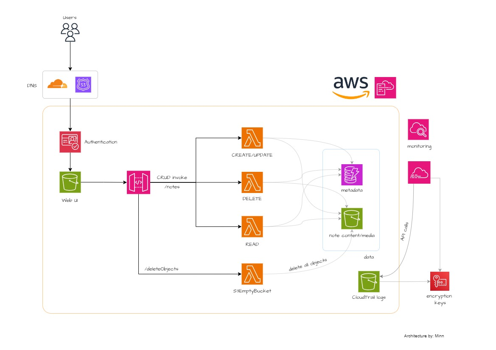
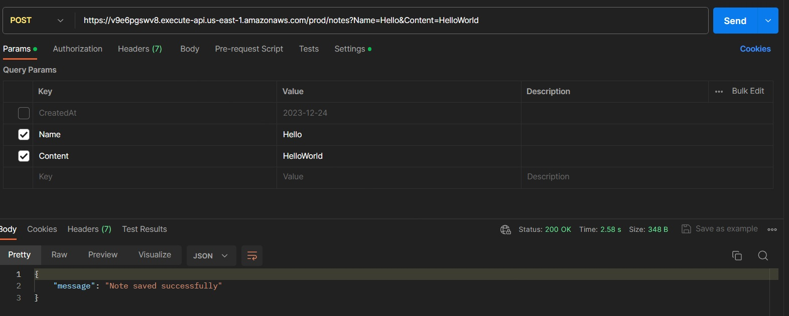
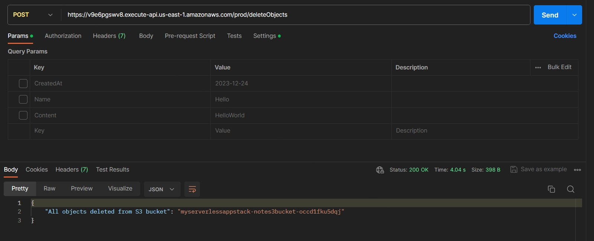

# Note-taking app with serverless backend

In this project, we will create a note-taking app with a serverless backend using AWS. We will use serverless functions to process  CRUD requests, a NoSQL database to store metadata, an object storage for media content, and the API Gateway, which will serve as an endpoint for the CRUD functions.

> [!CAUTION]
> This mini project simulates an environment and its architecture might lack some best practices. It is advised against using it for production environments. 

## Prerequisites
- AWS account 
- AWS CLI in `us-east-1` with admin privileges 

## Architecture Overview



## Technologies

- AWS
    - Lambda
    - S3
    - API Gateway
    - CloudFormation
    - CloudTrail
    - KMS
    - DynamoDB
- Python (Boto3)

## Project Hierachy

- `/CloudFormation-templates`: CloudFormation templates for the infrastructure
- `/lambda-code`: Source codes for CRUD and EmptyS3Bucket Lambda functions
- `/zipped-codes`: Zip format of Lambda functions codes

<br>

> [!NOTE]
> This project repository only contains backend configurations. It does not contain a frontend application, but the backend will fit with most CRUD operations apps.

<br>

### 1. Create the infrastructure

We will create two stacks for this project: <a href="https://aws.amazon.com/cloudtrail/">CloudTrail</a> and backend. 

I have already created a public S3 bucket that contains <a href="https://aws.amazon.com/cloudformation/">CloudFormation</a> templates and Lambda codes that we will use in this project. You can readily use it with the following commands.


#### Create a stack that will deploy and enable CloudTrail for the account

This stack will create three main things:
- KMS keys for encryption
- CloudTrail
- S3 bucket for CloudTrail logs

Since it's important to harden security, the API logs will be encrypted both at-rest and in-transit. For this purpose, we will generate encryption keys using <a href="https://aws.amazon.com/kms/">KMS</a> and CloudTrail will use those keys to encrypt the logs as well as the bucket.

Apply the stack via cli:

```
aws cloudformation create-stack \
--stack-name mycloudtrailstack \
--template-body https://code-for-note-functions-86.s3.amazonaws.com/cloudtrail-kms-s3.yaml
```

If you don't have AWS CLI configured, you can apply it via <a href="https://us-east-1.console.aws.amazon.com/cloudformation/home?region=us-east-1#/stacks/quickcreate?templateURL=https%3A%2F%2Fcode-for-note-functions-86.s3.amazonaws.com%2Fcloudtrail-kms-s3.yaml&stackName=mycloudtrailstack">One-click deployment link</a>. 

#### Create a stack that will deploy backend services

For the backend in this project, we will use <a href="https://aws.amazon.com/lambda/">Lambda functions</a> for CRUD operations, a <a href="https://aws.amazon.com/dynamodb/">DynamoDB table</a> for storing metadata, and a <a href="https://aws.amazon.com/s3/">S3 bucket</a> for storing media such as contents or images. There will be a single <a href="https://aws.amazon.com/api-gateway/">API Gateway</a> that will invoke backend functions based on different resource paths and methods.

This stack will create four main things:
- DynamoDB table
- S3 bucket
- Lambda functions
- API Gateway

```
aws cloudformation create-stack \ 
--stack-name myserverlessappstack \
--template-body https://code-for-note-functions-86.s3.amazonaws.com/serverless-backend.yaml \
--capabilities CAPABILITY_IAM
```

<a href="https://us-east-1.console.aws.amazon.com/cloudformation/home?region=us-east-1#/stacks/quickcreate?templateURL=https%3A%2F%2Fcode-for-note-functions-86.s3.amazonaws.com%2Fserverless-backend.yaml&stackName=myserverlessappstack&param_CodeBucketName=code-for-note-functions-86&param_ApiCRUDResourceName=notes&param_ApiEmptyS3ResourceName=deleteObjects&param_LambdaRuntime=python3.12&param_ApiStageName=prod">One-click deployment</a> (This may need IAM role with admin privileges)

### 2. Test the APIs

I have enabled <a href="https://docs.aws.amazon.com/apigateway/latest/developerguide/how-to-cors.html">CORS for my API Gateway</a>. You can adjust/disable this configuration based on your usage. The CloudFormation template will output two invoke links: CRUD and EmptyBucket. 

Let's test these APIs. You can use different tools such as curl. However, I will use Postman since it is more convenient. 

Here's the sample of how POST API method for CULambdaFunction looks like. 



The expected query parameters that I have written in my Lambda codes are as follows:

- **CU function**
    - Name 
    - Content
- **READ function**
    - CreatedAt
    - Name
- **DELETE function**
    - CreatedAt
    - Name

You can adjust the Lamda code based on your application use case.

Now, the `CULambdaFunction` stores the metadata(`CreatedAt` and `Name`)in the DynamoDB table and media(`Content`) in the S3 bucket. It's important to note that CloudFormation won't be able to delete a non-empty S3 bucket. 

I have written a python code that will be used by a Lambda function, and this will delete all the objects inside the S3 bucket that we created earlier with CloudFormation. You can invoke this Lambda function via API Gateway as well:




### 3. Clean up the resources

If you do not need the infrastructure anymore, you can clean up everything that we created earlier.

#### CloudTrail stack

This will delete everything *except* the S3 bucket. This will differ based on the environment, and I think it's better to retain the bucket containing tracing information for any further use.

```
aws cloudformation delete-stack --stack-name mycloudtrailstack
```

#### Backend stack

```
aws cloudformation delete-stack --stack-name myserverlessappstack
```

***

## Improvements needed

- Frontend UI hosted on S3 or ECS Fargate (for serverless purposes)
- Authentication of users (JWT, Firebase, Cognito)
    - Cognito is more expensive than other options.

Any contribution is welcomed with the aim of improving this mini project. 

